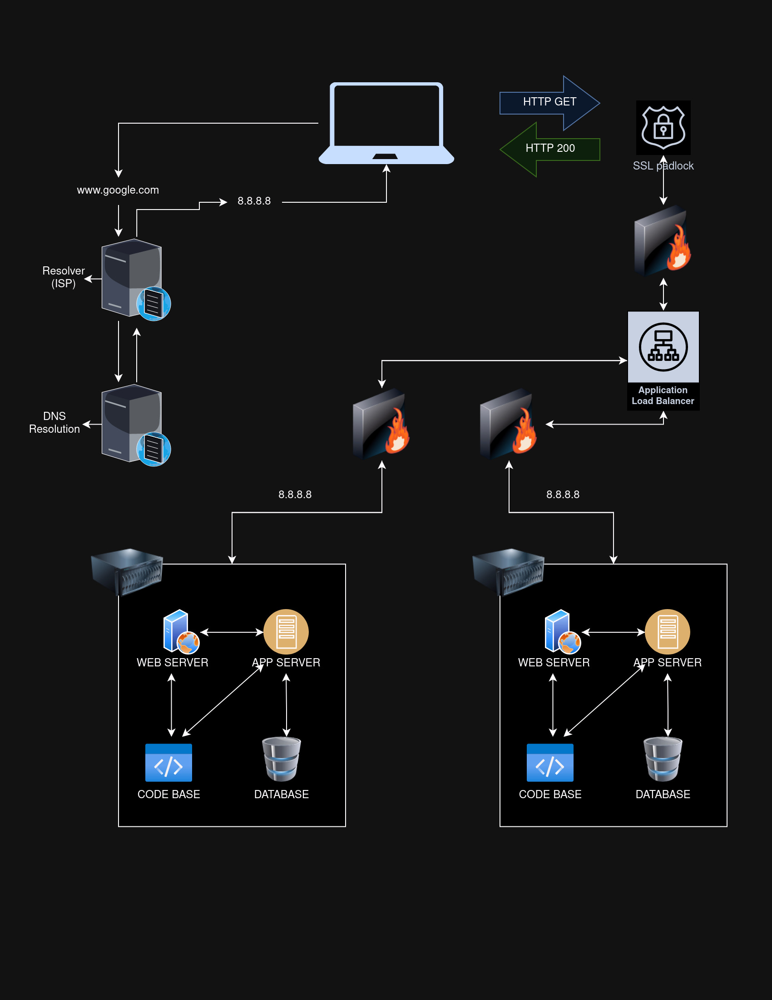

<h1 align="center"> What happens when we type www.google.com </h1>

   

Have you ever wondered what happens behind the scenes when you type "https://www.google.com" in your browser and press Enter? In this blog post, we will take a fascinating journey through the various stages involved in loading the Google homepage. From DNS requests to database queries, we'll uncover the intricate processes that enable you to access the world's most popular search engine.

   

   

* DNS Request:

    	Once you enter "https://www.google.com" in your browser, the first step is a DNS (Domain Name System) request. The browser communicates with a DNS resolver to translate the human-readable URL into an IP address. The resolver queries authoritative DNS servers until it obtains the IP address associated with "www.google.com."

* TCP/IP:

    	After obtaining the IP address, the browser establishes a TCP/IP (Transmission Control Protocol/Internet Protocol) connection with the server hosting Google's website. TCP ensures reliable data transmission by breaking the information into packets and verifying their successful delivery.

* Firewall:

    	Before the connection is established, the browser's request passes through firewalls. Firewalls act as a security measure, monitoring and controlling incoming and outgoing network traffic. They protect against unauthorized access and potential threats.

* HTTPS/SSL:
    
		Once the TCP/IP connection is established, the browser initiates an HTTPS (Hypertext Transfer Protocol Secure) handshake with the server. HTTPS provides a secure communication channel by encrypting the data exchanged between the browser and the server. SSL (Secure Sockets Layer) certificates validate the authenticity of the server, ensuring a trusted connection.

* Load Balancer:
    
		At this stage, the request may pass through a load balancer. Google utilizes load balancers to distribute incoming traffic across multiple servers to enhance performance, reliability, and scalability. Load balancers ensure that each server receives a fair share of requests, optimizing the overall user experience.

* Web Server:

    	Once the request reaches the web server, it processes the HTTP request sent by the browser. The web server retrieves the requested resources, such as HTML, CSS, JavaScript files, and images, from its storage.

* Application Server:

    	In complex applications like Google, an application server may come into play. The application server handles dynamic content generation and processing. It interacts with databases and other backend systems, combining data and business logic to generate the final response.

* Database:
    
		To provide the most relevant search results, Google relies on vast amounts of data stored in databases. The application server queries the database to retrieve the requested information. The database server retrieves, organizes, and delivers the data back to the application server.
