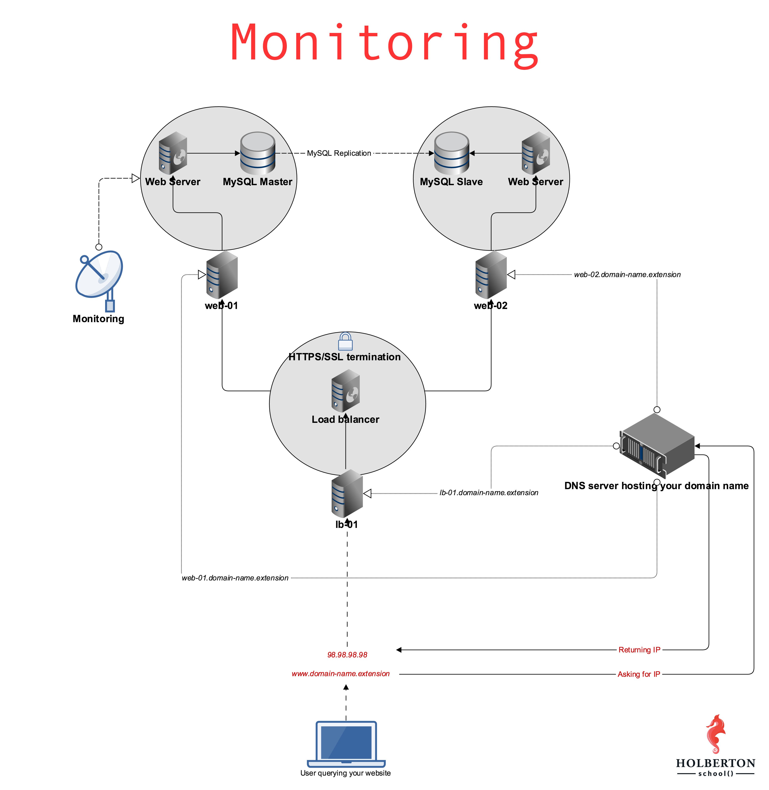

```

░█████╗░██╗░░██╗░░███╗░░░█████╗░░░░  
██╔══██╗╚██╗██╔╝░████║░░██╔══██╗░░░  
██║░░██║░╚███╔╝░██╔██║░░╚█████╔╝░░░  
██║░░██║░██╔██╗░╚═╝██║░░██╔══██╗░░░  
╚█████╔╝██╔╝╚██╗███████╗╚█████╔╝██╗  
░╚════╝░╚═╝░░╚═╝╚══════╝░╚════╝░╚═╝  

░██╗░░░░░░░██╗███████╗██████╗░░██████╗████████╗░█████╗░░█████╗░██╗░░██╗
░██║░░██╗░░██║██╔════╝██╔══██╗██╔════╝╚══██╔══╝██╔══██╗██╔══██╗██║░██╔╝
░╚██╗████╗██╔╝█████╗░░██████╦╝╚█████╗░░░░██║░░░███████║██║░░╚═╝█████═╝░
░░████╔═████║░██╔══╝░░██╔══██╗░╚═══██╗░░░██║░░░██╔══██║██║░░██╗██╔═██╗░
░░╚██╔╝░╚██╔╝░███████╗██████╦╝██████╔╝░░░██║░░░██║░░██║╚█████╔╝██║░╚██╗
░░░╚═╝░░░╚═╝░░╚══════╝╚═════╝░╚═════╝░░░░╚═╝░░░╚═╝░░╚═╝░╚════╝░╚═╝░░╚═╝

███╗░░░███╗░█████╗░███╗░░██╗██╗████████╗░█████╗░██████╗░██╗███╗░░██╗░██████╗░
████╗░████║██╔══██╗████╗░██║██║╚══██╔══╝██╔══██╗██╔══██╗██║████╗░██║██╔════╝░
██╔████╔██║██║░░██║██╔██╗██║██║░░░██║░░░██║░░██║██████╔╝██║██╔██╗██║██║░░██╗░
██║╚██╔╝██║██║░░██║██║╚████║██║░░░██║░░░██║░░██║██╔══██╗██║██║╚████║██║░░╚██╗
██║░╚═╝░██║╚█████╔╝██║░╚███║██║░░░██║░░░╚█████╔╝██║░░██║██║██║░╚███║╚██████╔╝
╚═╝░░░░░╚═╝░╚════╝░╚═╝░░╚══╝╚═╝░░░╚═╝░░░░╚════╝░╚═╝░░╚═╝╚═╝╚═╝░░╚══╝░╚═════╝░
```

<br><br><br>

#### Install or Update to the latest Agent 7 version on Ubuntu

##### Run this command to install or update...

- I used this commands to install the DataDog-Agent on my web-01 server:

```
DD_API_KEY=723138ee24dfd489a3a094c1239b00c3 DD_SITE="datadoghq.com" bash -c "$(curl -L https://s3.amazonaws.com/dd-agent/scripts/install_script_agent7.sh)"
```

- This will install the APT packages for the Datadog Agent and will prompt you for your password.
- If the Agent is not already installed on your machine and you don't want it to start automatically after the installation, just prepend DD_INSTALL_ONLY=true to the above script before running it.
- If you have an existing agent configuration file, those values will be retained during the update.

<br><br><br>

# Concepts

For this project, we expect you to look at these concepts:

- [Monitoring](https://intranet.alxswe.com/concepts/13)
- [Server](https://intranet.alxswe.com/concepts/67)

<br>



<br><br>

# Background Context

“You cannot fix or improve what you cannot measure” is a famous saying in the Tech industry. In the age of the data-ism, monitoring how our Software systems are doing is an important thing. In this project, we will implement one of many tools to measure what is going on our servers.

Web stack monitoring can be broken down into 2 categories:

- Application monitoring: getting data about your running software and making sure it is behaving as expected
- Server monitoring: getting data about your virtual or physical server and making sure they are not overloaded (could be CPU, memory, disk or network overload)

<br>


<br><br>

# Resources

#### Read or watch:

- [What is server monitoring](https://www.sumologic.com/glossary/server-monitoring/)
- [What is application monitoring](https://en.wikipedia.org/wiki/Application_performance_management)
- [System monitoring by Google](https://sre.google/sre-book/monitoring-distributed-systems/)
- [Nginx logging and monitoring](https://docs.nginx.com/nginx/admin-guide/monitoring/logging/)

<br><br>

# Learning Objectives

At the end of this project, you are expected to be able to [explain to anyone](https://fs.blog/feynman-learning-technique/), without the help of Google:

#### General

- Why is monitoring needed
- What are the 2 main area of monitoring
- What are access logs for a web server (such as Nginx)
- What are error logs for a web server (such as Nginx)

#### Copyright - Plagiarism

- You are tasked to come up with solutions for the tasks below yourself to meet with the above learning objectives.
- You will not be able to meet the objectives of this or any following project by copying and pasting someone else’s work.
- You are not allowed to publish any content of this project.
- Any form of plagiarism is strictly forbidden and will result in removal from the program.

<br><br>

Requirements
General

- Allowed editors: `vi`, `vim`, `emacs`
- All your files will be interpreted on Ubuntu 16.04 LTS
- All your files should end with a new line
- A `README.md` file, at the root of the folder of the project, is mandatory
- All your Bash script files must be executable
- Your Bash script must pass `Shellcheck` (version `0.3.7`) without any error
- The first line of all your Bash scripts should be exactly `#!/usr/bin/env bash`
- The second line of all your Bash scripts should be a comment explaining what is the script doing

<br><br>

# Tasks

<br><br>==========================================================================<br><br>

### 0. Sign up for Datadog and install datadog-agent

For this task head to https://www.datadoghq.com/ and sign up for a free `Datadog` account. When signing up, you’ll have the option of selecting statistics from your current stack that `Datadog` can monitor for you. Once you have an account set up, follow the instructions given on the website to install the `Datadog` agent.


- Sign up for Datadog - <b>Please make sure you are using the US website of Datagog (https://app.datadoghq.com)</b>
- Use the <b>US1</b> region
- Install `datadog-agent` on `web-01`
- Create an `application key`
- Copy-paste in your Intranet user profile ([here](https://intranet.alxswe.com/users/my_profile)) your DataDog `API key` and your DataDog `application key`.
- Your server `web-01` should be visible in Datadog under the host name `XX-web-01`
  - You can validate it by using this [API](https://docs.datadoghq.com/api/latest/hosts/)
  - If needed, you will need to update the hostname of your server

#### Repo:

- GitHub repository: `alx-system_engineering-devops`
- Directory: `0x18-webstack_monitoring`

<br><br>==========================================================================<br><br>

### 1. Monitor some metrics

Among the litany of data your monitoring service can report to you are system metrics. You can use these metrics to determine statistics such as reads/writes per second, which can help your company determine if/how they should scale. Set up some `monitors` within the `Datadog` dashboard to monitor and alert you of a few. You can read about the various system metrics that you can monitor here: [System Check](https://docs.datadoghq.com/integrations/system/).


- Set up a monitor that checks the number of read requests issued to the device per second.
- Set up a monitor that checks the number of write requests issued to the device per second.

#### Repo:

- GitHub repository: `alx-system_engineering-devops`
- Directory: `0x18-webstack_monitoring`

<br><br>==========================================================================<br><br>

### 2. Create a dashboard

Now create a dashboard with different metrics displayed in order to get a few different visualizations.

- Create a new `dashboard`
- Add at least 4 `widgets` to your dashboard. They can be of any type and monitor whatever you’d like
- Create the answer file `2-setup_datadog` which has the `dashboard_id` on the first line. <b>Note</b>: in order to get the id of your dashboard, you may need to use [Datadog’s API](https://docs.datadoghq.com/api/?lang=python#get-all-dashboards)

#### Repo:

- GitHub repository: `alx-system_engineering-devops`
- Directory: `0x18-webstack_monitoring`
- File: `2-setup_datadog`

<br><br>==========================================================================<br><br>

[-> Abdelemjid Essaid](https://github.com/abdelemjidessaid/alx-system_engineering-devops/tree/main/0x18-webstack_monitoring)
